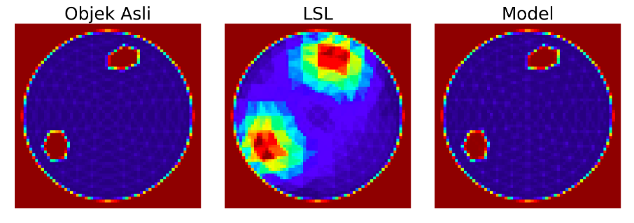

# Penerapan CNN-UNET Sebagai Metode Rekonstruksi Pada Sistem CWDOT

Repositori ini berisi kode dan sumber daya untuk penelitian skripsi saya di Departemen Fisika, Universitas Airlangga, yang berfokus pada pengembangan metode rekonstruksi pada sistem *Continuous Wave Diffuse Optical Tomography* (CW-DOT) menggunakan *deep learning*.

---

### **Demonstrasi Hasil**

Berikut adalah perbandingan visual antara metode rekonstruksi konvensional (LSL) dengan model yang diusulkan.


*(Gambar di atas menunjukkan bagaimana Model menghasilkan gambar yang mendekati objek asli)*

---

### **Metodologi**

Penelitian ini mengembangkan model rekonstruksi citra pada sistem Continuous-Wave Diffuse Optical Tomography (CW-DOT) dengan input berupa data intensitas dalam bentuk gambar dan output berupa citra rekonstruksi yang menyerupai objek asli. Data intensitas diproses melalui tahap normalisasi, serta pembagian menjadi training dan testing set.

Model dibangun menggunakan pendekatan deep learning (CNN) yang mempelajari pemetaan langsung dari distribusi intensitas ke citra rekonstruksi. Proses pelatihan dilakukan dengan meminimalkan fungsi loss BCE, sementara evaluasi performa menggunakan metrik MAE dan DSC untuk menilai kesesuaian hasil rekonstruksi dengan objek asli.

---

### **Instalasi & Setup**

Untuk menjalankan proyek ini, pastikan Anda memiliki Python 3.8+ dan pustaka yang diperlukan.

1.  **Clone repositori ini:**
    ```bash
    git clone [https://github.com/nama-anda/proyek-skripsi-dot.git](https://github.com/nama-anda/proyek-skripsi-dot.git)
    cd proyek-skripsi-dot
    ```

2.  **Buat environment virtual (disarankan):**
    ```bash
    python -m venv venv
    source venv/bin/activate  # Untuk Windows: venv\Scripts\activate
    ```

3.  **Install semua dependensi:**
    ```bash
    pip install -r requirements.txt
    ```

---

### **Cara Menggunakan**

Seluruh proses, mulai dari pembuatan arsitektur model, pelatihan model, hingga evaluasi hasil rekonstruksi dapat dijalankan langsung melalui notebook tunggal yang tersedia di folder notebooks/.
Cukup buka notebook tersebut dengan Jupyter Notebook atau Jupyter Lab, lalu jalankan sel-selnya secara berurutan untuk mereproduksi keseluruhan alur eksperimen.

---

### **Sitasi & Ucapan Terima Kasih**

* Simulasi numerik dijalankan menggunakan perangkat lunak yang dikembangkan oleh [Nama Peneliti, Tahun].
* Terima kasih kepada dosen pembimbing, Dr. Nuril Ukhrowiyah, M.Si dan Yhosep Gita Yhun Yhuwana, S.Si., M.T., atas bimbingan dan masukannya.
