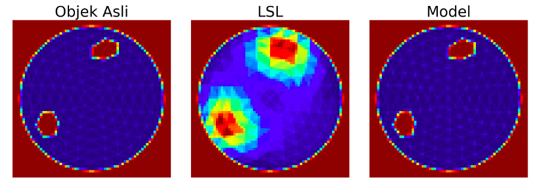

# 🧠 CNN-UNET for Reconstruction in Continuous-Wave Diffuse Optical Tomography (CW-DOT)

This repository contains the code and resources for my undergraduate thesis at the Department of Physics, Universitas Airlangga.  
The research focuses on developing a reconstruction method for the *Continuous-Wave Diffuse Optical Tomography* (CW-DOT) system using *deep learning*.  

---

## 📊 Demonstration Results  

Below is a visual comparison between the conventional reconstruction method (LSL) and the proposed CNN-UNET model.  

  

*(The figure above shows how the proposed model produces reconstructed images that are closer to the ground-truth object.)*  

---

## 🔬 Methodology  

This research develops an image reconstruction model for the CW-DOT system.  

- **Input**: intensity distribution (image format)  
- **Output**: reconstructed images resembling the ground-truth object  

The workflow includes:  
1. **Preprocessing** – normalization of intensity data and splitting into training/testing sets.  
2. **Model** – a deep learning architecture (CNN-UNET) is used to directly learn the mapping from input intensities to reconstructed images.  
3. **Training** – the model is trained with Binary Cross Entropy (BCE) loss.  
4. **Evaluation** – performance is measured using **Mean Absolute Error (MAE)** and **Dice Similarity Coefficient (DSC)**.  

---

## ⚙️ Installation & Setup  

Requirements: **Python 3.8+** and the listed dependencies.  

1. **Clone this repository**  
   ```bash
   git clone https://github.com/your-username/cwdot-cnn-unet.git
   cd cwdot-cnn-unet
   ```

2. **Create a virtual environment (recommended)**  
   ```bash
   python -m venv venv
   source venv/bin/activate  # Windows: venv\Scripts\activate
   ```

3. **Install dependencies**  
   ```bash
   pip install -r requirements.txt
   ```

---

## 🚀 Usage  

The full workflow — model construction, training, and evaluation — can be run directly from the provided Jupyter Notebook:  

```bash
jupyter notebook notebooks/CNN_UNET_CW-DOT.ipynb
```  

Simply run the cells in order to reproduce the experiments.  

---

## 📂 Project Structure  

```bash
├── data/               # Dataset (simulated or real measurement data)
├── notebooks/          # Jupyter notebooks for training & evaluation
├── outputs/            # Saved figures and reconstructed results
│   └── figures/        # Visualization results
├── src/                # Source code (model, utils, training scripts)
├── requirements.txt    # Python dependencies
└── README.md           # Project documentation
```  

---

## 📚 Citation & Acknowledgements  

- Numerical simulation was based on the software developed by **Ukhrowiyah (2018)**.  
- Special thanks to my supervisors:  
  - **Dr. Nuril Ukhrowiyah, M.Si**  
  - **Yhosep Gita Yhun Yhuwana, S.Si., M.T.**  

If you use this code or dataset in your research, please cite accordingly.  
